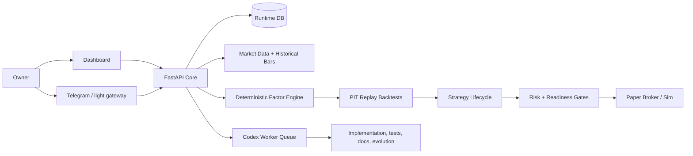

# EvoQ

<p align="center">
  <a href="README.zh-CN.md">中文 README</a> ·
  <a href="docs/next-gen/EVOQ-BEGINNER-README.md">Beginner Guide</a> ·
  <a href="docs/next-gen/EVOQ-USER-MANUAL.md">User Manual</a> ·
  <a href="docs/next-gen/README.md">Docs Index</a>
</p>

<p align="center">
  <a href="https://github.com/zhoucehuang-arch/evoq/actions/workflows/ci.yml"></a>
  <a href="LICENSE"></a>
  
  
</p>

<p align="center">
  <strong>Dashboard-first quant research and paper-trading runtime with LLM-assisted research, deterministic factor/backtest gates, and live-trading guardrails.</strong>
</p>

<p align="center">
  
</p>

> EvoQ is research and operations software, not financial advice. Keep the system in paper mode until you have verified data quality, backtests, broker sync, risk controls, and owner approvals.

## What EvoQ Is

EvoQ is a long-running autonomous investment runtime for builders who want the useful parts of LLMs without letting an LLM become the trading engine.

The product splits responsibilities deliberately:

- **Dashboard-first owner workflow**: Data, Research, Strategy, Trading, Learning, Evolution, System, and Incidents are operated from the web dashboard.
- **Quant-first signal path**: market data, historical bars, factors, factor snapshots, PIT replay backtests, costs, baselines, and lineage are deterministic.
- **LLM-assisted research layer**: LLMs can propose ideas, summarize evidence, challenge assumptions, and diagnose failures, but cannot bypass quant/risk gates.
- **Paper-first execution**: broker-facing behavior is gated by market session state, account snapshots, reconciliation, provider health, stale-data checks, and explicit promotion decisions.
- **Codex execution plane**: Codex-style workers implement, test, document, and evolve the system; they do not become the system of record.

## Current Capabilities

| Area | What works now |
|---|---|
| Local runtime | Windows/PowerShell local API + dashboard startup and smoke validation |
| Dashboard | Owner workbench, research, strategy, data, trading, learning, evolution, system, and incident pages |
| Market data | Providers, watchlists, quote snapshots, freshness, local replay bars, historical bars API |
| Factor engine | `momentum_close_return`, `reversal_close_return`, `realized_volatility`, `dollar_volume_liquidity` |
| Backtesting | PIT factor replay backtest with cost/slippage, baseline comparison, input-bar lineage, and equity curve |
| Strategy lifecycle | research brief -> hypothesis -> spec -> backtest -> paper run -> promotion / withdrawal |
| Execution readiness | market session, broker snapshot, reconciliation, provider incidents, overrides, stale quote blocking |
| Deployment docs | single-VPS-first runbooks, Core/Worker scale-out docs, backup/restore, break-glass guidance |

## How It Compares To Familiar Open-Source Patterns

EvoQ is intentionally closer to a governed operating system than a single notebook or bot:

- Like **Qlib**, it treats quant research as a pipeline from data to models/signals/backtests.
- Like **OpenBB**, it values a usable research surface instead of hiding everything behind scripts.
- Like **FinGPT-style projects**, it uses LLMs for financial research and reasoning, but keeps deterministic finance logic outside the LLM.

The key difference: EvoQ is optimized for an owner-operated, dashboard-first, paper-first runtime with explicit gates before anything capital-facing.

## Quick Start: Local Product Run

### Prerequisites

- Python 3.11+
- Node.js 20+
- PowerShell
- `npm ci` run once in `apps/dashboard-web`
- Python dependencies installed with `python -m pip install -e ".[dev]"`

### Start the local runtime

```powershell
powershell.exe -NoProfile -ExecutionPolicy Bypass -File .\ops\tools\start_local.ps1
```

Then open:

- Dashboard: `http://127.0.0.1:3000`
- API health: `http://127.0.0.1:8000/healthz`

The local script uses SQLite at `.runtime/evoq-local.db` and a local dashboard API token by default.

### Verify it

```powershell
powershell.exe -NoProfile -ExecutionPolicy Bypass -File .\ops\tools\smoke_local.ps1
```

Expected result:

```text
EvoQ local smoke passed.
```

## First Useful Workflow

Use this path to understand the product quickly:

1. **Data**: register a provider such as `local-replay`.
2. **Data**: paste replay OHLCV bars into the historical-bar importer.
3. **Data**: generate factor snapshots, starting with `momentum_close_return`.
4. **Workbench / Research**: create a research brief and let the audit gate classify it.
5. **Strategy**: promote a ready brief into a hypothesis and create a deterministic strategy spec.
6. **Strategy**: run a factor replay backtest with cost, slippage, baseline refs, and PIT controls.
7. **Strategy**: record a paper run and a promotion decision only when evidence is clean.
8. **Trading**: check execution readiness before any broker-facing action.
9. **Incidents**: approve/reject pending actions and use overrides for pause/resume.

For a beginner-friendly Chinese walkthrough, start with [EVOQ-BEGINNER-README.md](docs/next-gen/EVOQ-BEGINNER-README.md).

## Safety Model

EvoQ has hard product boundaries:

- LLM output does **not** place trades.
- Backtests do **not** pass without cost assumptions, baselines, PIT controls, and data lineage.
- Paper execution is blocked by stale market data, missing market sessions, broker snapshot age, reconciliation mismatch, provider incidents, or active overrides.
- Live readiness is report-only unless explicitly configured and approved; the report endpoint cannot place orders.
- Broker credentials should stay on the Core runtime, not on worker nodes.

## Architecture



Design rule: **one authoritative Core, one runtime database, deterministic finance logic, LLMs as research/challenge support, and owner-visible gates.**

## Repository Layout

| Path | Purpose |
|---|---|
| `src/quant_evo_nextgen` | backend API, contracts, services, DB models, control-plane logic |
| `apps/dashboard-web` | Next.js operator dashboard |
| `alembic/versions` | database migrations |
| `ops/tools` | local Windows start, smoke, and test helpers |
| `ops/production` | Core/Worker deployment examples |
| `docs/next-gen` | current product docs, user manual, deployment runbooks, reviews |
| `workspace` | repo-backed memory, knowledge, candidate strategies, trading artifacts |
| `legacy/original-system` | archived earlier project material |
| `tests` | regression coverage for services and API behavior |

## Validation Commands

```powershell
cd apps\dashboard-web
npm run build
cd ..\..
powershell.exe -NoProfile -ExecutionPolicy Bypass -File .\ops\tools\run_tests.ps1 -q
powershell.exe -NoProfile -ExecutionPolicy Bypass -File .\ops\tools\smoke_local.ps1
```

Latest local validation in this workspace:

- Dashboard build: passed
- Backend/service tests: `135 passed`
- Local smoke: passed

## Deployment

Recommended first deployment:

- one VPS
- `single_vps_compact`
- local Postgres
- paper broker posture
- dashboard as the main owner surface
- Telegram only as a light alert/approval gateway

Start with:

1. [GitHub to VPS Deployment Guide](docs/next-gen/GITHUB-TO-VPS-DEPLOYMENT.md)
2. [VPS Deployment Runbook](docs/next-gen/VPS-DEPLOYMENT-RUNBOOK.md)
3. [First Paper Run Checklist](docs/next-gen/FIRST-PAPER-RUN-CHECKLIST.md)
4. [Break Glass Runbook](docs/next-gen/BREAK-GLASS-RUNBOOK.md)

For a single-machine VPS bootstrap, the repo-local helper is:

```bash
./ops/bin/quickstart-single-vps.sh
```

Related operator helpers:

```bash
./ops/bin/onboard-single-vps.sh
./ops/bin/system-doctor.sh
./ops/bin/bootstrap-node.sh core
./ops/bin/bootstrap-node.sh worker
```

## Documentation Map

| Goal | Read |
|---|---|
| New user overview | [Beginner README](docs/next-gen/EVOQ-BEGINNER-README.md) |
| Daily operation | [User Manual](docs/next-gen/EVOQ-USER-MANUAL.md) |
| Product scope | [Product Overview](docs/next-gen/PRODUCT-OVERVIEW.md) |
| Current delivery state | [Complete Delivery Plan](docs/next-gen/EVOQ-COMPLETE-DELIVERY-PLAN.md) |
| All docs | [Docs Index](docs/next-gen/README.md) |
| Environment variables | [Environment Parameters](docs/env-params.md) |
| Security | [Security Policy](SECURITY.md) |
| Contributing | [Contributing Guide](CONTRIBUTING.md) |

## Project Status

EvoQ is ready for local dashboard-first paper-mode experimentation and continued VPS deployment hardening. Treat live trading as locked behind explicit configuration, readiness reporting, paper evidence, and owner approval.

## License

MIT. See [LICENSE](LICENSE).
