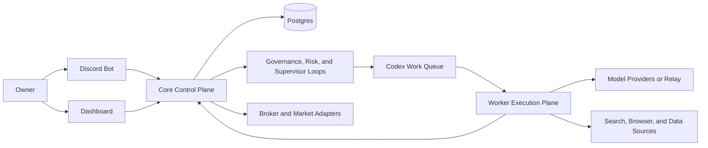

# Quant Evo Next-Gen

## English

Quant Evo Next-Gen is an autonomous investment platform designed for long-running operation on VPS infrastructure.

It combines research acquisition, multi-agent review, strategy development, governed execution, risk control, operator approvals, and dashboard monitoring in one system. The main owner experience is built around Discord and a web dashboard, so the operator can work in natural language instead of living in the terminal.

### Why This Project Exists

Most autonomous trading stacks still leave the owner babysitting prompts, terminals, and one-off scripts.

Quant Evo Next-Gen treats autonomy as an operating-system problem instead:

- durable state instead of prompt residue
- governed workflows instead of ad hoc agent chatter
- Discord and dashboard surfaces instead of terminal-only control
- paper-first activation and rollback paths instead of blind live switching

The goal is not to maximize the number of agents. The goal is to keep research, learning, self-improvement, and trading moving forward without turning the system into something the owner cannot govern.

### Who This Project Is For

- operators who want Discord-first control and a dashboard-first review surface
- builders who want Codex-powered workers without making the worker plane authoritative
- teams or solo owners who care about paper-first activation, audit trails, approvals, and rollback discipline

### Who This Project Is Not For

- people looking for a one-file retail bot or a zero-ops hosted product
- operators who want ungoverned live trading from day one
- users who do not want to manage Linux hosts, secrets, and deployment posture

### What This Project Does

- collects and organizes market research and external information
- uses specialized agents to debate, review, and refine ideas before action
- turns research into strategy proposals, backtests, paper runs, and production decisions
- runs governed trading workflows with audit trails, approvals, and rollback paths
- exposes runtime status through Discord and a dashboard
- supports long-running deployment on VPS infrastructure with recovery and maintenance workflows

### Recommended Deployment Shape

- `1 Discord bot`
- `1 Core VPS`
- `1 Worker VPS`
- `Postgres` as the runtime source of truth
- `paper` mode first, then controlled promotion to live

### Simplest First Deploy

If you want the shortest supported path first, start with one VPS:

- run `./ops/bin/quickstart-single-vps.sh`
- keep `QE_DEPLOYMENT_TOPOLOGY=single_vps_compact`
- let the Core stack host `codex-fabric-runner`
- stay in `paper` mode while the acquisition and learning loops settle

That single-VPS mode keeps the same Discord and dashboard operating model. When you want stronger isolation later, you can move to `Core + Worker` without changing the product surface.

### Architecture At A Glance

The main design rule is simple: one authoritative Core, one runtime database, and a worker plane that can scale without multiplying masters.

### Repository Layout

- `src/quant_evo_nextgen`: backend runtime, control plane, services, and workflows
- `apps/dashboard-web`: operator dashboard
- `ops`: deployment scripts, smoke checks, backup, restore, and systemd helpers
- `docs/next-gen`: architecture, operations, deployment, and runbooks
- `tests`: regression and service-level coverage

### Getting Started

If you want to publish this project to GitHub and deploy it to VPS nodes, start here:

1. [Product Overview](docs/next-gen/PRODUCT-OVERVIEW.md)
2. [FAQ](docs/next-gen/FAQ.md)
3. [GitHub to VPS Deployment Guide](docs/next-gen/GITHUB-TO-VPS-DEPLOYMENT.md)
4. [First Paper Run Checklist](docs/next-gen/FIRST-PAPER-RUN-CHECKLIST.md)
5. [Operator Journeys](docs/next-gen/OPERATOR-JOURNEYS.md)
6. [Owner Operation Quickstart](docs/next-gen/OWNER-OPERATION-QUICKSTART.md)
7. [Current Delivery Status](docs/next-gen/CURRENT-DELIVERY-STATUS.md)
8. [Next-Gen Docs Index](docs/next-gen/README.md)

### Quick Deploy Summary

For a one-VPS first deploy:

1. Push this repository to GitHub.
2. Clone it to `/opt/quant-evo-nextgen` on the VPS.
3. Run `./ops/bin/quickstart-single-vps.sh`.
4. If you prefer to inspect the deploy draft before starting services, use `./ops/bin/onboard-single-vps.sh --no-start`.
5. Review `ops/production/core/core.env`, including `QE_OPENAI_API_KEY` and `QE_OPENAI_BASE_URL` if you use a relay.
6. Verify it with `./ops/bin/core-smoke.sh` if you used `--no-start`, or let the quickstart path run it automatically.
7. Keep the first activation in `paper` mode.

For the long-term two-node shape:

- use `./ops/bin/bootstrap-node.sh core` on Core
- use `./ops/bin/bootstrap-node.sh worker` on Worker
- start with `./ops/bin/core-up.sh` and `./ops/bin/worker-up.sh`
- verify with `./ops/bin/core-smoke.sh` and `./ops/bin/worker-smoke.sh`

### Relay Support

This system supports OpenAI-compatible relay endpoints and Codex-compatible execution.

When you use a relay, configure these values on both Core and Worker nodes:

- `QE_OPENAI_API_KEY`
- `QE_OPENAI_BASE_URL`

### Documentation

- [Product Overview](docs/next-gen/PRODUCT-OVERVIEW.md)
- [FAQ](docs/next-gen/FAQ.md)
- [GitHub to VPS Deployment Guide](docs/next-gen/GITHUB-TO-VPS-DEPLOYMENT.md)
- [Single-VPS and Acquisition Review](docs/next-gen/SINGLE-VPS-AND-ACQUISITION-REVIEW.md)
- [First Paper Run Checklist](docs/next-gen/FIRST-PAPER-RUN-CHECKLIST.md)
- [Operator Journeys](docs/next-gen/OPERATOR-JOURNEYS.md)
- [VPS Deployment Runbook](docs/next-gen/VPS-DEPLOYMENT-RUNBOOK.md)
- [Backup and Restore Runbook](docs/next-gen/BACKUP-AND-RESTORE-RUNBOOK.md)
- [Break-Glass Runbook](docs/next-gen/BREAK-GLASS-RUNBOOK.md)
- [Owner Operation Quickstart](docs/next-gen/OWNER-OPERATION-QUICKSTART.md)
- [Current Delivery Status](docs/next-gen/CURRENT-DELIVERY-STATUS.md)
- [Next-Gen Architecture Index](docs/next-gen/README.md)

## 中文

Quant Evo Next-Gen 是一套面向 VPS 长期运行的自治投资系统。

它把研究获取、多角色审议、策略研发、受治理的交易执行、风控、审批、监控和运维入口整合到同一套系统里。整个产品的核心交互方式是 `Discord + Dashboard`，目标是让 owner 主要通过自然语言和网页完成操作，而不是长期停留在终端里盯脚本。

### 为什么做这个项目

很多“自动投资”系统最后都会退化成：

- 需要人长期盯 prompt 和日志
- 需要人手动拼命令和脚本
- 一旦故障就只能 SSH 上去硬查
- 一碰到 live 就很难治理、很难回滚、很难审计

Quant Evo Next-Gen 想解决的是这些根问题：

- 用持久化状态替代 prompt 残留
- 用受治理的工作流替代随意的 agent 对话
- 用 Discord 和 Dashboard 替代终端优先的操作方式
- 用 paper-first、审批、回滚和风控替代盲目切到 live

这个项目不是为了堆更多 agent，而是为了让研究、学习、自进化和交易都能持续推进，同时仍然可治理、可审计、可恢复。

### 适合谁

- 希望主要通过 Discord 控制系统、通过 Dashboard 观察系统的人
- 希望用 Codex 驱动 worker，但不希望把交易权下放给 worker 的人
- 重视 paper-first、审批、审计和回滚纪律的个人或小团队

### 不适合谁

- 想要零运维、一键即用、单脚本 retail bot 的用户
- 希望第一天就无治理地直接 live 的用户
- 不愿意管理 Linux 主机、密钥和部署姿态的用户

### 这个项目能做什么

- 持续收集和组织市场研究与外部信息
- 通过多角色 agent 进行讨论、质疑、评审和交叉校验
- 将研究结果推进为策略假设、规格、回测、纸面运行和生产决策
- 在审批、回滚、风控和审计边界内执行交易工作流
- 通过 Discord 和 Dashboard 暴露系统状态
- 支持长期运行在 VPS 上，并具备升级、恢复、备份和 break-glass 路径

### 推荐部署形态

- `1 Discord Bot`
- `1 Core VPS`
- `1 Worker VPS`
- `Postgres` 作为运行时事实来源
- 第一次先以 `paper` 模式运行，再逐步推进到受控 live

如果你想先走最简单的产品路径，也支持：

- `1 VPS`
- `QE_DEPLOYMENT_TOPOLOGY=single_vps_compact`
- Core 同时承载 `codex-fabric-runner`

这条路径非常适合第一次部署、单机验证和 owner 熟悉整套系统。

### 最简单的首次部署

如果你想先用一台 VPS 跑通：

1. 把仓库推到 GitHub。
2. 在 VPS 上 clone 到 `/opt/quant-evo-nextgen`。
3. 运行 `./ops/bin/quickstart-single-vps.sh`。
4. 如果想先检查部署草稿，再运行 `./ops/bin/onboard-single-vps.sh --no-start`。
5. 检查 `ops/production/core/core.env`。
6. 如果使用了 `--no-start`，再手动运行 `./ops/bin/core-smoke.sh`；否则让 quickstart 路径自动完成验证。
7. 第一阶段保持 `paper` 模式。

如果后续需要更稳的长期运行，再扩展为 `Core + Worker` 两台 VPS。

### 文档入口

建议按这个顺序阅读：

1. [Product Overview](docs/next-gen/PRODUCT-OVERVIEW.md)
2. [FAQ](docs/next-gen/FAQ.md)
3. [GitHub to VPS Deployment Guide](docs/next-gen/GITHUB-TO-VPS-DEPLOYMENT.md)
4. [First Paper Run Checklist](docs/next-gen/FIRST-PAPER-RUN-CHECKLIST.md)
5. [Operator Journeys](docs/next-gen/OPERATOR-JOURNEYS.md)
6. [Owner Operation Quickstart](docs/next-gen/OWNER-OPERATION-QUICKSTART.md)
7. [Current Delivery Status](docs/next-gen/CURRENT-DELIVERY-STATUS.md)
8. [Next-Gen Docs Index](docs/next-gen/README.md)

### 中转支持

这套系统支持 OpenAI 兼容中转和 Codex 兼容执行。

如果你使用中转，请在 Core 和 Worker 上都配置：

- `QE_OPENAI_API_KEY`
- `QE_OPENAI_BASE_URL`

### 重要文档

- [Product Overview](docs/next-gen/PRODUCT-OVERVIEW.md)
- [FAQ](docs/next-gen/FAQ.md)
- [GitHub to VPS Deployment Guide](docs/next-gen/GITHUB-TO-VPS-DEPLOYMENT.md)
- [Single-VPS and Acquisition Review](docs/next-gen/SINGLE-VPS-AND-ACQUISITION-REVIEW.md)
- [First Paper Run Checklist](docs/next-gen/FIRST-PAPER-RUN-CHECKLIST.md)
- [Operator Journeys](docs/next-gen/OPERATOR-JOURNEYS.md)
- [VPS Deployment Runbook](docs/next-gen/VPS-DEPLOYMENT-RUNBOOK.md)
- [Backup and Restore Runbook](docs/next-gen/BACKUP-AND-RESTORE-RUNBOOK.md)
- [Break-Glass Runbook](docs/next-gen/BREAK-GLASS-RUNBOOK.md)
- [Owner Operation Quickstart](docs/next-gen/OWNER-OPERATION-QUICKSTART.md)
- [Current Delivery Status](docs/next-gen/CURRENT-DELIVERY-STATUS.md)
- [Next-Gen Architecture Index](docs/next-gen/README.md)
