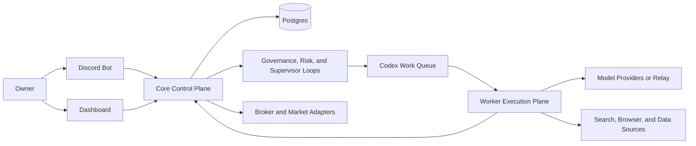

# Quant Evo Next-Gen

[Chinese README](README.zh-CN.md)

[](https://github.com/zhoucehuang-arch/quant-evo-nextgen/actions/workflows/ci.yml)
[](LICENSE)

Quant Evo Next-Gen is a Discord-first autonomous investment platform built for long-running VPS operation.

It combines research intake, multi-agent review, governed strategy development, controlled execution, risk management, approvals, and dashboard monitoring in one system. The goal is not to maximize the number of agents. The goal is to keep research, learning, self-improvement, and trading moving forward without turning the runtime into something the owner cannot govern.

## Why It Exists

Most autonomous trading stacks still leave the owner babysitting prompts, terminals, and one-off scripts.

Quant Evo Next-Gen treats autonomy as an operating-system problem instead:

- durable state instead of prompt residue
- governed workflows instead of ad hoc agent chatter
- Discord and dashboard surfaces instead of terminal-only control
- paper-first activation and rollback paths instead of blind live switching

## Screenshots

Overview dashboard:


Mobile dashboard:


## What You Get

- Discord-first owner control with governed approvals and runtime config changes
- a web dashboard for monitoring trading, learning, evolution, incidents, and system state
- Codex-centered worker execution without making the worker plane authoritative
- paper-first trading posture with explicit promotion, rollback, and incident paths
- a single-VPS-first product path that can scale to `Core + Worker` later

## Market Modes

One deployment chooses one market mode:

- `QE_DEPLOYMENT_MARKET_MODE=us`
  - US equities
  - US options
  - governed mixed sleeve operation when strategy policy allows it
- `QE_DEPLOYMENT_MARKET_MODE=cn`
  - China A-share research, ranking, and calendar-aware paper-first operation

If you want both markets active at the same time, run separate deployments.

## Current Trading Surface

- `US` mode currently supports governed equities, single-leg options, multi-leg option structures, short-equity paths with borrow and margin gates, and Alpaca-backed paper/live progression.
- `CN` mode currently supports China A-share research, ranking, market-calendar-aware supervision, and paper-first operation under the same Discord and dashboard shell.

Current honest boundaries:

- `CN live` broker execution is not shipped yet
- portfolio sleeve attribution is still conservative
- universal maintenance-margin, borrow-fee, and locate modeling is not fully closed for every product path

## Memory And Learning

The product keeps two memory layers on purpose:

- runtime learning mesh
  - research documents, evidence items, and insight candidates live in durable database state
- promoted long-term memory
  - promoted principles, causal cases, and feature-map lineage remain repo-backed under `memory/` and `evo/feature_map.json`

The dashboard distinguishes runtime learning from promoted long-term memory so the owner can tell what has merely been collected from what has actually been promoted.

## Deployment Shape

Start with:

- `1 Discord bot`
- `1 VPS` running `single_vps_compact`
- `Postgres` on the same host as the runtime source of truth
- `paper` mode first, then controlled promotion to live

Scale out later when needed:

- keep `Core` as the authority node
- add `1 Worker VPS` for Codex-heavy execution and research
- keep broker-facing secrets on Core only

Useful scale-out helpers:

- `./ops/bin/bootstrap-node.sh core`
- `./ops/bin/bootstrap-node.sh worker`

## Fastest First Deploy

Typical one-line bring-up on a Debian or Ubuntu VPS:

```bash
sudo apt-get update && sudo apt-get install -y git && cd /opt && sudo git clone <your-github-repo-url> quant-evo-nextgen && sudo chown -R "$USER":"$USER" /opt/quant-evo-nextgen && cd /opt/quant-evo-nextgen && ./ops/bin/quickstart-single-vps.sh
```

If you prefer the guided draft-first path:

```bash
cd /opt/quant-evo-nextgen
./ops/bin/onboard-single-vps.sh --no-start
./ops/bin/core-up.sh
./ops/bin/core-smoke.sh
./ops/bin/system-doctor.sh
```

Keep the first activation in `paper` mode.

## Architecture At A Glance



The main design rule is simple: one authoritative Core, one runtime database, and a worker plane that can scale without multiplying masters.

## Repository Layout

- `src/quant_evo_nextgen`
  - backend runtime, control plane, services, and workflows
- `apps/dashboard-web`
  - operator dashboard
- `ops`
  - deployment scripts, smoke checks, backup, restore, and systemd helpers
- `docs/next-gen`
  - architecture, operations, deployment, and runbooks
- `tests`
  - regression and service-level coverage

## Start Here

1. [Product Overview](docs/next-gen/PRODUCT-OVERVIEW.md)
2. [FAQ](docs/next-gen/FAQ.md)
3. [GitHub to VPS Deployment Guide](docs/next-gen/GITHUB-TO-VPS-DEPLOYMENT.md)
4. [First Paper Run Checklist](docs/next-gen/FIRST-PAPER-RUN-CHECKLIST.md)
5. [Owner Operation Quickstart](docs/next-gen/OWNER-OPERATION-QUICKSTART.md)
6. [Current Delivery Status](docs/next-gen/CURRENT-DELIVERY-STATUS.md)
7. [Next-Gen Docs Index](docs/next-gen/README.md)

## Relay Support

This system supports OpenAI-compatible relay endpoints and Codex-compatible execution.

When you use a relay, configure:

- `QE_OPENAI_API_KEY`
- `QE_OPENAI_BASE_URL`

## Project Health

- [LICENSE](LICENSE)
- [CODE_OF_CONDUCT.md](CODE_OF_CONDUCT.md)
- [CONTRIBUTING.md](CONTRIBUTING.md)
- [SECURITY.md](SECURITY.md)
- [SUPPORT.md](SUPPORT.md)
- [Pull Request Template](.github/PULL_REQUEST_TEMPLATE.md)

## Documentation

- [Product Overview](docs/next-gen/PRODUCT-OVERVIEW.md)
- [FAQ](docs/next-gen/FAQ.md)
- [GitHub to VPS Deployment Guide](docs/next-gen/GITHUB-TO-VPS-DEPLOYMENT.md)
- [VPS Deployment Runbook](docs/next-gen/VPS-DEPLOYMENT-RUNBOOK.md)
- [Owner Operation Quickstart](docs/next-gen/OWNER-OPERATION-QUICKSTART.md)
- [Current Delivery Status](docs/next-gen/CURRENT-DELIVERY-STATUS.md)
- [GSTACK Full Product Re-Review](docs/next-gen/GSTACK-FULL-PRODUCT-REREVIEW.md)
- [Multi-Market Quant Architecture Review](docs/next-gen/MULTI-MARKET-QUANT-ARCHITECTURE-REVIEW.md)
- [Three Core Points Research and Optimization Plan](docs/next-gen/THREE-CORE-POINTS-RESEARCH-AND-OPTIMIZATION-PLAN.md)
