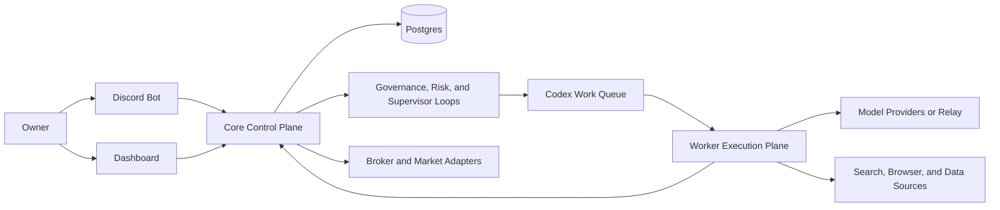

# Quant Evo Next-Gen

<p align="center">
  <a href="README.zh-CN.md">Chinese README</a>
</p>

<p align="center">
  <a href="https://github.com/zhoucehuang-arch/quant-evo-nextgen/actions/workflows/ci.yml"></a>
  <a href="LICENSE"></a>
</p>

<p align="center">
  Discord-first autonomous investment platform for governed research, learning, evolution, and paper-first or live-gated execution.
</p>

<p align="center">
  <a href="docs/next-gen/GITHUB-TO-VPS-DEPLOYMENT.md">Deploy to VPS</a> •
  <a href="docs/next-gen/OWNER-OPERATION-QUICKSTART.md">Owner Quickstart</a> •
  <a href="docs/next-gen/FIRST-PAPER-RUN-CHECKLIST.md">First Paper Run</a> •
  <a href="docs/next-gen/README.md">Docs Index</a>
</p>

<table>
  <tr>
    <td width="76%">
      
    </td>
    <td width="24%">
      
    </td>
  </tr>
</table>

<p align="center">
  Dashboard overview and mobile operator view from the English product surface.
</p>

## What It Is

Quant Evo Next-Gen is a long-running autonomous investment runtime built around one idea: autonomy only matters if it stays governable.

The system combines:

- Discord-based owner control
- a web dashboard for monitoring trading, learning, evolution, incidents, and runtime state
- Codex-centered worker execution behind a governed control plane
- durable memory and proposal workflows instead of prompt residue
- paper-first activation, approval gates, canaries, and rollback paths

This is not an "unlimited agents talking to each other" stack. It is a productized runtime for keeping research, self-improvement, and trading moving forward without turning operations into chaos.

## Why This Architecture

Most autonomous trading projects still force the owner to babysit prompts, terminals, and manual scripts.

Quant Evo Next-Gen treats the problem as an operating-system problem instead:

- one authoritative Core instead of multiple competing masters
- one durable runtime database instead of context-only state
- governed workflows instead of ad hoc agent chatter
- Discord and dashboard surfaces instead of terminal-only interaction
- explicit paper-to-live progression instead of blind live switching

## What You Get

| Surface | What it does |
|---|---|
| Discord control plane | natural-language status, approvals, pauses, deploy-draft changes, governed config updates |
| Dashboard | operator visibility for trading, learning, evolution, incidents, and system health |
| Core runtime | authority node for supervision, risk, memory, config, and execution governance |
| Worker plane | Codex-heavy research and execution tasks without becoming the system of record |
| VPS deploy path | single-VPS-first install that can later scale to `Core + Worker` |

## Market Modes

One deployment chooses one market mode:

| Mode | Supports today | Notes |
|---|---|---|
| `us` | US equities, US options, governed mixed sleeves, short-equity paths with borrow and margin gates | Alpaca-backed paper and live-gated progression |
| `cn` | China A-share research, ranking, calendar-aware supervision, paper-first operation | CN live broker execution is not shipped yet |

If you want both markets active at the same time, run separate deployments.

## Current Honest Boundaries

- `CN live` broker execution is not shipped yet.
- Portfolio sleeve attribution is still conservative.
- Universal maintenance-margin, borrow-fee, and locate modeling is not fully closed for every product path.

## Memory And Learning

The product deliberately keeps two memory layers:

- runtime learning mesh
- promoted long-term memory

Raw research, evidence items, and insight candidates live in durable runtime state. Promoted principles, causal cases, and feature-map lineage stay repo-backed under `memory/` and `evo/feature_map.json`.

That split matters: the owner can tell the difference between material that has merely been collected and material that has been promoted into durable operating memory.

## Deployment Shape

Recommended first deployment:

- `1 Discord bot`
- `1 VPS`
- `single_vps_compact`
- local `Postgres`
- `paper` broker posture first

Scale later only if you actually need stronger isolation:

- keep `Core` as the authority node
- add `1 Worker VPS` for Codex-heavy execution and research
- keep broker-facing secrets on Core only

Useful helpers:

- `./ops/bin/bootstrap-node.sh core`
- `./ops/bin/bootstrap-node.sh worker`

## Deploy In 60 Seconds

Typical first deploy on Debian or Ubuntu:

```bash
sudo apt-get update && sudo apt-get install -y git && cd /opt && sudo git clone <your-github-repo-url> quant-evo-nextgen && sudo chown -R "$USER":"$USER" /opt/quant-evo-nextgen && cd /opt/quant-evo-nextgen && ./ops/bin/quickstart-single-vps.sh
```

Draft-first bring-up:

```bash
cd /opt/quant-evo-nextgen
./ops/bin/onboard-single-vps.sh --no-start
./ops/bin/core-up.sh
./ops/bin/core-smoke.sh
./ops/bin/system-doctor.sh
```

Keep the first activation in `paper` mode.

## Architecture At A Glance



The design rule is simple: one authoritative Core, one runtime database, and a worker plane that can scale without multiplying masters.

## Repository Layout

| Path | Purpose |
|---|---|
| `src/quant_evo_nextgen` | backend runtime, services, workflows, control plane |
| `apps/dashboard-web` | operator dashboard |
| `ops` | deployment scripts, smoke checks, update helpers, systemd installers |
| `docs/next-gen` | architecture, runbooks, deployment guides, operator docs |
| `tests` | regression and service-level coverage |

## Start Here

1. [Product Overview](docs/next-gen/PRODUCT-OVERVIEW.md)
2. [FAQ](docs/next-gen/FAQ.md)
3. [GitHub to VPS Deployment Guide](docs/next-gen/GITHUB-TO-VPS-DEPLOYMENT.md)
4. [First Paper Run Checklist](docs/next-gen/FIRST-PAPER-RUN-CHECKLIST.md)
5. [Owner Operation Quickstart](docs/next-gen/OWNER-OPERATION-QUICKSTART.md)
6. [Current Delivery Status](docs/next-gen/CURRENT-DELIVERY-STATUS.md)
7. [Next-Gen Docs Index](docs/next-gen/README.md)

## Relay Support

This system supports OpenAI-compatible relay endpoints and Codex-compatible execution.

When you use a relay, configure:

- `QE_OPENAI_API_KEY`
- `QE_OPENAI_BASE_URL`

## Project Health

- [LICENSE](LICENSE)
- [CODE_OF_CONDUCT.md](CODE_OF_CONDUCT.md)
- [CONTRIBUTING.md](CONTRIBUTING.md)
- [SECURITY.md](SECURITY.md)
- [SUPPORT.md](SUPPORT.md)
- [Pull Request Template](.github/PULL_REQUEST_TEMPLATE.md)

## Documentation

- [Product Overview](docs/next-gen/PRODUCT-OVERVIEW.md)
- [FAQ](docs/next-gen/FAQ.md)
- [GitHub to VPS Deployment Guide](docs/next-gen/GITHUB-TO-VPS-DEPLOYMENT.md)
- [VPS Deployment Runbook](docs/next-gen/VPS-DEPLOYMENT-RUNBOOK.md)
- [Owner Operation Quickstart](docs/next-gen/OWNER-OPERATION-QUICKSTART.md)
- [Current Delivery Status](docs/next-gen/CURRENT-DELIVERY-STATUS.md)
- [GSTACK Full Product Re-Review](docs/next-gen/GSTACK-FULL-PRODUCT-REREVIEW.md)
- [Multi-Market Quant Architecture Review](docs/next-gen/MULTI-MARKET-QUANT-ARCHITECTURE-REVIEW.md)
- [Three Core Points Research and Optimization Plan](docs/next-gen/THREE-CORE-POINTS-RESEARCH-AND-OPTIMIZATION-PLAN.md)
