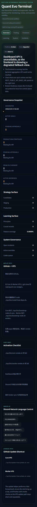
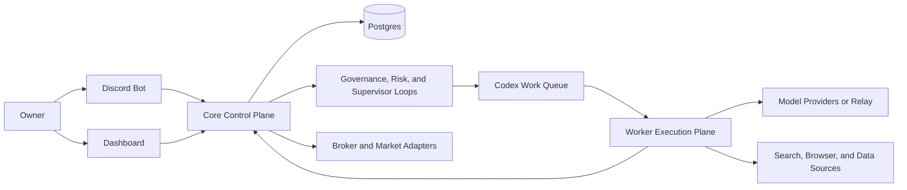

# Quant Evo Next-Gen

[English](README.md)

Quant Evo Next-Gen 是一套面向 VPS 长期运行的 Discord 优先自治投资系统。

它把研究采集、多 agent 评审、受治理的策略开发、交易执行、风控、审批和 dashboard 监控整合到同一套产品里。目标不是把 agent 数量堆到越多越好，而是在可治理、可回滚、可长期运转的前提下，让研究、学习、自进化和投资持续推进。

## 这个项目为什么存在

很多所谓“自动投资”系统最后都会退化成：

- 需要人长期盯 prompt 和日志
- 需要人手动拼命令和脚本
- 一旦故障就只能 SSH 上去硬查
- 一到 live 阶段就很难治理、回滚和审计

Quant Evo Next-Gen 试图把这些问题系统化解决：

- 用持久化状态替代 prompt 残留
- 用受治理的工作流替代随意的 agent 对话
- 用 Discord 和 Dashboard 替代终端优先的操作方式
- 用 paper-first、审批、回滚和风控替代盲目切到 live

## 截图

Overview 页面：


移动端页面：



## 核心能力

- Discord 优先的 owner 控制与审批流
- 面向交易、学习、进化、事故和系统状态的 dashboard
- 以 Codex 为核心的 worker 执行层，但不让 worker 变成权威层
- paper-first 的交易治理方式，带有 promotion、rollback 和 incident 路径
- 单 VPS 优先的产品路径，后续再扩展到 `Core + Worker`

## 市场模式

一个部署实例只能选择一个市场模式：

- `QE_DEPLOYMENT_MARKET_MODE=us`
  - 美股正股
  - 美股期权
  - 在策略治理允许时支持混合 sleeves
- `QE_DEPLOYMENT_MARKET_MODE=cn`
  - A 股研究、选股与时段治理下的 paper-first 运行

如果你希望美股和 A 股同时运行，应该部署两套实例，而不是把两个市场揉进同一实例。

## 当前交易面能力

- `US` 模式当前支持受治理的美股正股、单腿期权、多腿期权结构、带 borrow / margin gate 的做空路径，以及 Alpaca 驱动的 paper/live 渐进式推进。
- `CN` 模式当前支持 A 股研究、选股、交易时段治理以及 paper-first 运行。

当前仍需诚实保留的边界：

- `CN live` broker 执行还没有交付
- 组合 sleeve attribution 仍偏保守
- 通用 maintenance margin、borrow fee 和 locate 建模还没有覆盖全部产品路径

## 记忆与学习

这套系统有意保留两层记忆：

- 运行时学习网格
  - 研究文档、证据项和 insight 候选写入持久化数据库状态
- 提升后的长期记忆
  - 提升后的 principles、causal cases 和 feature-map lineage 仍然保持 repo-backed，落在 `memory/` 和 `evo/feature_map.json`

Dashboard 会把运行时学习状态与长期记忆分开展示，避免把“刚采集到的内容”和“已经沉淀成长期记忆的内容”混为一谈。

## 推荐部署形态

建议先从下面这套形态开始：

- `1 Discord bot`
- `1 VPS`
- `single_vps_compact`
- `Postgres` 与运行时同机
- 第一阶段保持 `paper` 模式，再逐步推进到受控 live

后续如果需要更强隔离和更高研究吞吐，再扩展为：

- `1 Core VPS`
- `1 Worker VPS`
- broker 相关密钥只放在 Core

## 最快的首次部署方式

在 Debian 或 Ubuntu VPS 上，最短路径是：

```bash
sudo apt-get update && sudo apt-get install -y git && cd /opt && sudo git clone <your-github-repo-url> quant-evo-nextgen && sudo chown -R "$USER":"$USER" /opt/quant-evo-nextgen && cd /opt/quant-evo-nextgen && ./ops/bin/quickstart-single-vps.sh
```

如果你更喜欢先生成部署草稿，再手动启动服务：

```bash
cd /opt/quant-evo-nextgen
./ops/bin/onboard-single-vps.sh --no-start
./ops/bin/core-up.sh
./ops/bin/core-smoke.sh
./ops/bin/system-doctor.sh
```

第一次激活请保持在 `paper` 模式。

## 架构总览



核心设计原则很简单：只有一个权威 Core、一个运行时数据库、一个可扩展但不多主的 worker 平面。

## 仓库结构

- `src/quant_evo_nextgen`
  - 后端运行时、控制面、服务与工作流
- `apps/dashboard-web`
  - operator dashboard
- `ops`
  - 部署脚本、smoke check、备份恢复与 systemd 资产
- `docs/next-gen`
  - 架构、运维、部署与 runbook
- `tests`
  - 回归测试与服务级验证

## 推荐阅读顺序

1. [Product Overview](docs/next-gen/PRODUCT-OVERVIEW.md)
2. [FAQ](docs/next-gen/FAQ.md)
3. [GitHub to VPS Deployment Guide](docs/next-gen/GITHUB-TO-VPS-DEPLOYMENT.md)
4. [First Paper Run Checklist](docs/next-gen/FIRST-PAPER-RUN-CHECKLIST.md)
5. [Owner Operation Quickstart](docs/next-gen/OWNER-OPERATION-QUICKSTART.md)
6. [Current Delivery Status](docs/next-gen/CURRENT-DELIVERY-STATUS.md)
7. [Next-Gen Docs Index](docs/next-gen/README.md)

## 中转支持

这套系统支持 OpenAI 兼容中转和 Codex 兼容执行。

需要配置：

- `QE_OPENAI_API_KEY`
- `QE_OPENAI_BASE_URL`

## 项目规范

- [LICENSE](LICENSE)
- [CODE_OF_CONDUCT.md](CODE_OF_CONDUCT.md)
- [CONTRIBUTING.md](CONTRIBUTING.md)
- [SECURITY.md](SECURITY.md)
- [SUPPORT.md](SUPPORT.md)
