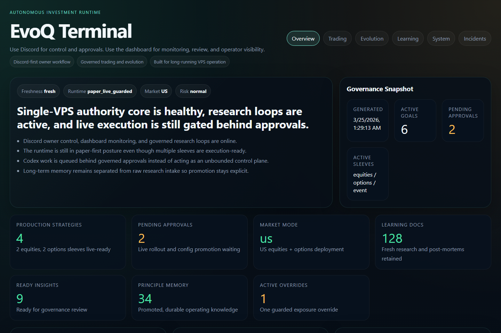
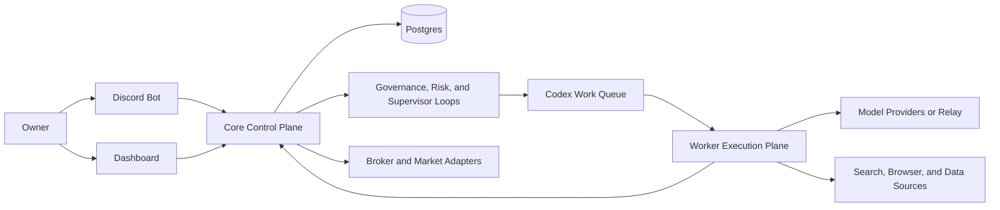

# EvoQ

[English](README.md)

EvoQ 是一套面向 VPS 长期运行的 Discord 优先自治投资系统。

它把研究采集、多角色评审、受治理的策略迭代、交易执行、风控、审批、长期记忆和 Dashboard 监控收敛到同一套产品里。目标不是堆更多 agent，而是在可治理、可审计、可回滚、可持续运行的前提下，让系统长期推进研究、学习、自进化与投资。

## 这是什么

EvoQ 的核心定位是一个可长期运行的自治投资运行时，而不是一次性的 prompt 编排。

它提供：

- Discord 优先的 owner 控制与审批入口
- 用于监控交易、学习、进化、事故和系统状态的 Web Dashboard
- 以 Codex 为主执行引擎的 Worker 平面
- 基于持久化状态和治理工作流的长期记忆与演进机制
- `paper-first`、审批门、canary 和 rollback 路径

## 为什么是这种架构

很多“自动投资”项目最后都会退化成需要人持续盯命令行、盯 prompt、盯脚本的系统。

EvoQ 把问题当作“运行时系统”来解决：

- 一个权威 Core，而不是多个互相竞争的主控
- 一个持久化运行时数据库，而不是只靠上下文
- 受治理的工作流，而不是随意的 agent 对话
- Discord 和 Dashboard 作为主要交互面，而不是终端优先
- 明确的 `paper -> live` 渐进式激活路径，而不是直接切到 live

## 截图

概览页面：



移动端页面：


## 你会得到什么

| 模块 | 作用 |
|---|---|
| Discord control plane | 自然语言状态查询、审批、暂停、配置变更草案 |
| Dashboard | 观察交易、学习、进化、事故和系统健康 |
| Core runtime | 风控、记忆、配置、执行治理和系统监督 |
| Worker plane | 承担 Codex 驱动的研究与执行任务，但不成为系统事实来源 |
| VPS deploy path | 单 VPS 优先，可在后续扩展到 `Core + Worker` |

## 市场模式

一套部署实例只能选择一个市场模式：

| 模式 | 当前支持 | 说明 |
|---|---|---|
| `us` | 美股正股、美股期权、受治理的混合 sleeves、带 borrow 和 margin gate 的做空路径 | 基于 Alpaca 的 paper-first 和 live-gated 路径 |
| `cn` | A 股研究、选股、时段治理、paper-first 运行 | `CN live` 券商执行暂未交付 |

如果你希望美股和 A 股同时运行，应该部署两套独立实例。

## 当前边界

- `CN live` 券商执行还没有完成。
- 组合 sleeve attribution 仍然保持保守。
- 通用的 maintenance margin、borrow fee 和 locate 建模还没有覆盖所有产品路径。

## 记忆与学习

系统有意分成两层记忆：

- 运行时学习网格
- 提升后的长期记忆

原始研究、证据和 insight 候选存放在持久化运行时状态里。被正式提升后的原则、因果案例和 feature-map lineage 则保存在仓库内的 `memory/` 与 `evo/feature_map.json` 中。

这种分层能让 owner 明确区分“刚采集到的内容”和“已经被提升为长期操作记忆的内容”。

## 推荐部署形态

建议的首次部署：

- `1 Discord bot`
- `1 VPS`
- `single_vps_compact`
- 本地 `Postgres`
- 先保持 `paper` 模式

只有在确实需要更强隔离或更高研究吞吐时，再扩展到：

- 保持 `Core` 作为唯一权威节点
- 增加 `1 Worker VPS`
- broker 凭据只放在 Core

## 60 秒部署

在 Debian 或 Ubuntu VPS 上，最短路径是：

```bash
sudo apt-get update && sudo apt-get install -y git && cd /opt && sudo git clone <your-github-repo-url> evoq && sudo chown -R "$USER":"$USER" /opt/evoq && cd /opt/evoq && ./ops/bin/quickstart-single-vps.sh
```

如果你希望先生成部署草稿，再手动启动：

```bash
cd /opt/evoq
./ops/bin/onboard-single-vps.sh --no-start
./ops/bin/core-up.sh
./ops/bin/core-smoke.sh
./ops/bin/system-doctor.sh
```

第一次激活请保持在 `paper` 模式。

## 架构总览



设计原则很简单：一个权威 Core、一个运行时数据库、一个可扩展但不多主的 Worker 平面。

## 仓库结构

| 路径 | 作用 |
|---|---|
| `src/quant_evo_nextgen` | 后端运行时、服务、工作流和控制面 |
| `apps/dashboard-web` | Dashboard 前端 |
| `ops` | 部署脚本、smoke checks、更新工具、systemd 安装器 |
| `docs/next-gen` | 架构、部署、runbook 和操作文档 |
| `tests` | 回归测试和服务级验证 |

## 推荐阅读顺序

1. [Product Overview](docs/next-gen/PRODUCT-OVERVIEW.md)
2. [FAQ](docs/next-gen/FAQ.md)
3. [GitHub to VPS Deployment Guide](docs/next-gen/GITHUB-TO-VPS-DEPLOYMENT.md)
4. [First Paper Run Checklist](docs/next-gen/FIRST-PAPER-RUN-CHECKLIST.md)
5. [Owner Operation Quickstart](docs/next-gen/OWNER-OPERATION-QUICKSTART.md)
6. [Current Delivery Status](docs/next-gen/CURRENT-DELIVERY-STATUS.md)
7. [Docs Index](docs/next-gen/README.md)

## 中转支持

系统支持 OpenAI 兼容中转和 Codex 兼容执行。

需要配置：

- `QE_OPENAI_API_KEY`
- `QE_OPENAI_BASE_URL`

## 项目规范

- [LICENSE](LICENSE)
- [CODE_OF_CONDUCT.md](CODE_OF_CONDUCT.md)
- [CONTRIBUTING.md](CONTRIBUTING.md)
- [SECURITY.md](SECURITY.md)
- [SUPPORT.md](SUPPORT.md)
