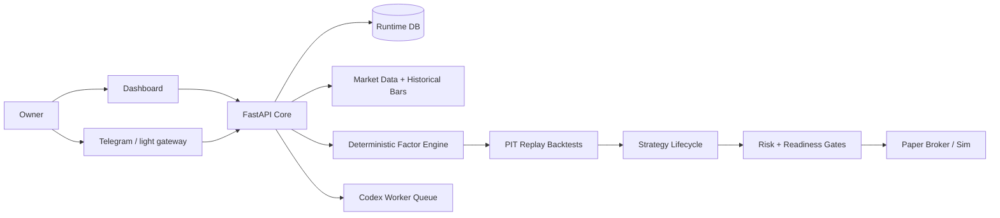

# EvoQ

[English README](README.md)

EvoQ 是一个 **Dashboard 优先** 的量化研究与 paper-trading 运行时：LLM 负责研究、解释、挑战和诊断；确定性量化链路负责数据、因子、回测、风险和执行门禁。

> 这不是金融建议，也不是“让 LLM 直接下单”的项目。第一次使用请保持 paper 模式，先验证数据、因子、回测、paper、风控和审批。

## 一句话理解

EvoQ 想解决的是：如何让“金融 + 量化 + 大模型”的系统长期运行，同时仍然可审计、可暂停、可回滚、可解释。

它的核心分工是：

- **Dashboard 是主操作界面**：Data、Research、Strategy、Trading、Learning、Evolution、System、Incidents 都在 dashboard 上看和操作。
- **量化核心是确定性的**：market data、historical bars、factor snapshots、PIT replay backtest、成本、baseline、lineage 都由系统计算和记录。
- **LLM 是研究和治理助手**：它可以提出想法、总结证据、挑战假设、诊断失败，但不能绕过回测、paper、风险和审批。
- **交易路径 paper-first**：没有干净的 market session、broker snapshot、reconciliation、freshness、promotion 和 approval，不应该进入 capital-facing 执行。

## 当前能做什么

| 模块 | 当前能力 |
|---|---|
| 本地运行 | Windows/PowerShell 一键启动 API + Dashboard，并可 smoke 验证 |
| Dashboard | Workbench、Research、Strategy、Data、Trading、Learning、Evolution、System、Incidents |
| 市场数据 | provider、watchlist、quote、freshness、local replay bars、historical bars API |
| 因子 | `momentum_close_return`、`reversal_close_return`、`realized_volatility`、`dollar_volume_liquidity` |
| 回测 | 从 factor snapshots 运行 PIT replay backtest，包含成本、滑点、baseline、lineage、equity curve |
| 策略生命周期 | research brief -> hypothesis -> spec -> backtest -> paper run -> promotion / withdrawal |
| 执行门禁 | market session、broker snapshot、reconciliation、provider incident、override、stale quote blocking |
| 部署文档 | 单 VPS 优先，后续 Core/Worker 扩展，backup/restore，break-glass runbook |

## 和同类开源项目的关系

EvoQ 借鉴了几类优秀项目的组织方式：

- 类似 Qlib，把量化研究看成从数据到信号、回测、上线的 pipeline。
- 类似 OpenBB，重视研究入口和可用的操作界面，而不只是脚本。
- 类似 FinGPT 方向，把 LLM 放在金融研究和理解层，但不让 LLM 直接控制交易事实。

EvoQ 的不同点是：它更关注 owner 可以长期运行的 **dashboard-first、paper-first、quant-first、LLM-governed** 产品形态。

## 本地快速启动

### 前置条件

- Python 3.11+
- Node.js 20+
- PowerShell
- 在 `apps/dashboard-web` 执行过 `npm ci`
- 在仓库根目录执行过 `python -m pip install -e ".[dev]"`

### 启动

```powershell
powershell.exe -NoProfile -ExecutionPolicy Bypass -File .\ops\tools\start_local.ps1
```

打开：

- Dashboard: `http://127.0.0.1:3000`
- API health: `http://127.0.0.1:8000/healthz`

默认使用 SQLite：`.runtime/evoq-local.db`。

### 验证

```powershell
powershell.exe -NoProfile -ExecutionPolicy Bypass -File .\ops\tools\smoke_local.ps1
```

看到下面结果说明本地产品入口可用：

```text
EvoQ local smoke passed.
```

## 第一次应该怎么玩

建议按这个顺序理解：

1. 在 **Data** 页面注册 `local-replay` provider。
2. 在 **Data** 页面粘贴 OHLCV historical bars。
3. 在 **Data** 页面生成 factor snapshots。
4. 在 **Workbench / Research** 创建 research brief。
5. 在 **Research** 查看 brief 是 `Ready`、`Needs evidence` 还是 `Blocked`。
6. 在 **Strategy** 把 ready brief 推进到 hypothesis，再创建 deterministic spec。
7. 在 **Strategy** 使用 `Factor replay` 生成 PIT backtest。
8. 在 **Strategy** 记录 paper run 和 promotion decision。
9. 在 **Trading** 查看 execution readiness。
10. 在 **Incidents** 处理 approvals，并在需要时 pause/resume。

更适合新手的说明见：[EVOQ-BEGINNER-README.md](docs/next-gen/EVOQ-BEGINNER-README.md)。

## 安全边界

- LLM 不直接交易。
- Backtest 缺少成本、baseline、PIT controls、input-bar lineage 时不能通过 gate。
- 已有行情数据但 quote 超过 48 小时，会阻断 execution readiness。
- live readiness endpoint 只生成报告，不下单。
- broker credentials 应该留在 Core，不放在 Worker。
- 实盘前必须先有 paper evidence、risk readiness 和 owner approval。

## 架构简图



设计规则：**一个权威 Core，一个运行时数据库，确定性金融逻辑，LLM 只做研究/挑战/治理辅助。**

## 仓库结构

| 路径 | 作用 |
|---|---|
| `src/quant_evo_nextgen` | 后端 API、contracts、services、DB models、控制面 |
| `apps/dashboard-web` | Next.js Dashboard |
| `alembic/versions` | 数据库迁移 |
| `ops/tools` | 本地 Windows 启动、测试、smoke 工具 |
| `ops/production` | Core/Worker 部署示例 |
| `docs/next-gen` | 当前产品文档、用户手册、部署 runbook、评审 |
| `workspace` | 仓库内 memory、knowledge、strategies、trading artifacts |
| `legacy/original-system` | 早期系统归档 |
| `tests` | 服务和 API 回归测试 |

## 常用验证命令

```powershell
cd apps\dashboard-web
npm run build
cd ..\..
powershell.exe -NoProfile -ExecutionPolicy Bypass -File .\ops\tools\run_tests.ps1 -q
powershell.exe -NoProfile -ExecutionPolicy Bypass -File .\ops\tools\smoke_local.ps1
```

当前本地验证结果：

- Dashboard build：通过
- 后端/服务测试：`135 passed`
- Local smoke：通过

## 部署入口

首次建议：

- 一台 VPS
- `single_vps_compact`
- 本地 Postgres
- paper 模式
- Dashboard 主操作
- Telegram 只做轻提醒和审批入口

阅读顺序：

1. [GitHub to VPS Deployment Guide](docs/next-gen/GITHUB-TO-VPS-DEPLOYMENT.md)
2. [VPS Deployment Runbook](docs/next-gen/VPS-DEPLOYMENT-RUNBOOK.md)
3. [First Paper Run Checklist](docs/next-gen/FIRST-PAPER-RUN-CHECKLIST.md)
4. [Break Glass Runbook](docs/next-gen/BREAK-GLASS-RUNBOOK.md)

## 文档地图

| 目标 | 文档 |
|---|---|
| 新手理解 | [Beginner README](docs/next-gen/EVOQ-BEGINNER-README.md) |
| 日常使用 | [User Manual](docs/next-gen/EVOQ-USER-MANUAL.md) |
| 产品定位 | [Product Overview](docs/next-gen/PRODUCT-OVERVIEW.md) |
| 当前计划和状态 | [Complete Delivery Plan](docs/next-gen/EVOQ-COMPLETE-DELIVERY-PLAN.md) |
| 全部文档 | [Docs Index](docs/next-gen/README.md) |
| 环境变量 | [Environment Parameters](docs/env-params.md) |
| 安全 | [Security Policy](SECURITY.md) |
| 贡献 | [Contributing Guide](CONTRIBUTING.md) |

## License

MIT。见 [LICENSE](LICENSE)。
